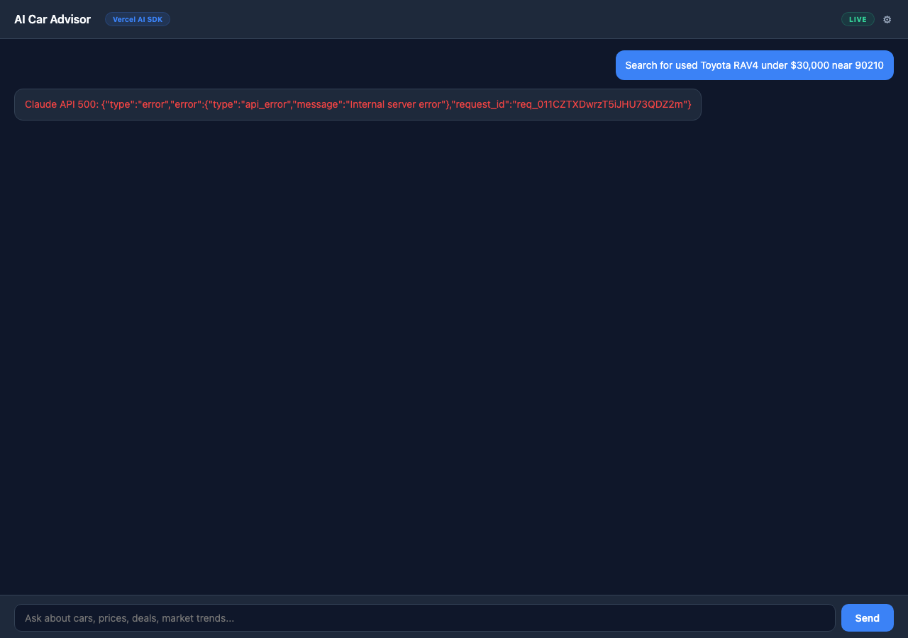

# AI Car Advisor (Vercel AI SDK) 



## Overview

Reference chat implementation using the Vercel AI SDK pattern. Features streaming responses, tool call visualization with status chips, and collapsible tool result details. Supports Anthropic Claude, OpenAI GPT-4o, and Google Gemini as LLM providers.

## Who Is This For

Developers exploring AI chat integrations with MarketCheck data

## MarketCheck API Endpoints Used

| Endpoint | Name | Docs |
|----------|------|------|
| `GET /v2/search/car/active` | Search Active Listings | [View docs](https://apidocs.marketcheck.com/#search-active) |
| `GET /v2/decode/car/neovin/{vin}/specs` | VIN Decode | [View docs](https://apidocs.marketcheck.com/#decode-vin) |
| `GET /v2/predict/car/us/marketcheck_price/comparables` | Price Prediction | [View docs](https://apidocs.marketcheck.com/#price-prediction) |
| `GET /v2/history/car/{vin}` | Car History | [View docs](https://apidocs.marketcheck.com/#car-history) |
| `GET /v2/incentives/by-zip` | OEM Incentives | [View docs](https://apidocs.marketcheck.com/#incentives) |
| `GET /api/v1/sold-vehicles/summary` | Sold Vehicle Summary | [View docs](https://apidocs.marketcheck.com/#sold-summary) |

## How to Run

### Browser (standalone)

Open the app directly in a browser with your MarketCheck API key:

```
https://apps.marketcheck.com/app/chat-vercel-ai/?api_key=YOUR_API_KEY
```

### MCP (Model Context Protocol)

Add to your MCP client configuration (e.g. Claude Desktop):

```json
{
  "mcpServers": {
    "marketcheck": {
      "command": "npx",
      "args": [
        "-y",
        "@anthropic/marketcheck-mcp"
      ],
      "env": {
        "MARKETCHECK_API_KEY": "YOUR_API_KEY"
      }
    }
  }
}
```

### Embed (iframe)

Embed in any webpage:

```html
<iframe src="https://apps.marketcheck.com/app/chat-vercel-ai/?api_key=YOUR_API_KEY" width="100%" height="800" frameborder="0"></iframe>
```

## Limitations

- Demo mode shows mock data
- Requires MarketCheck API key for live data
- Browser-based — no server required for standalone use
- Chat apps require an LLM API key (Anthropic, OpenAI, or Google Gemini)
- Data covers US market (95%+ of dealer inventory)

## Links

- [MarketCheck Developer Portal](https://developers.marketcheck.com)
- [API Documentation](https://apidocs.marketcheck.com)
- [AI Car Advisor (Vercel AI SDK) App](https://apps.marketcheck.com/app/chat-vercel-ai/)
- [GitHub Repository](https://github.com/anthropics/marketcheck-mcp-apps)
