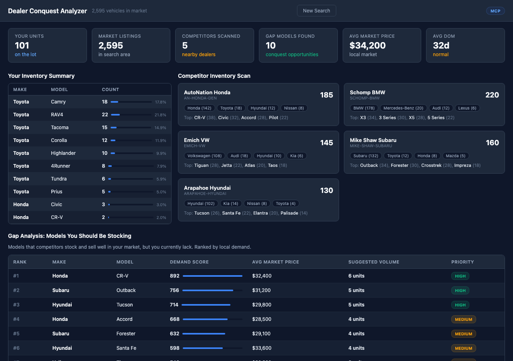

# Dealer Conquest Analyzer 



## Overview

Compares your inventory against the broader market within your radius. Identifies gaps — makes, models, and body types that are selling well in your market but missing from your lot. Uses sold demand data to rank conquest opportunities.

## Who Is This For

Used car dealers, inventory managers, and pricing analysts

## MarketCheck API Endpoints Used

| Endpoint | Name | Docs |
|----------|------|------|
| `GET /v2/search/car/active` | Search Active Listings | [View docs](https://apidocs.marketcheck.com/#search-active) |
| `GET /api/v1/sold-vehicles/summary` | Sold Vehicle Summary | [View docs](https://apidocs.marketcheck.com/#sold-summary) |

## Parameters

| Name | Type | Required | Description |
|------|------|----------|-------------|
| `dealer_id` | string | Yes | Your Dealer ID |
| `zip` | string | Yes | Market center ZIP |
| `radius` | number | No | Market radius (default 50 mi) |
| `state` | string | Yes | State for demand data |

## Derivative API Endpoint

**`POST https://apps.marketcheck.com/api/proxy/analyze-dealer-conquest`**

> This is a composite endpoint that orchestrates multiple MarketCheck API calls into a single response. It is provided for reference and experimentation purposes only and is not under LTS (Long-Term Support).

## How to Run

### Browser (standalone)

Open the app directly in a browser with your MarketCheck API key:

```
https://apps.marketcheck.com/app/dealer-conquest-analyzer/?api_key=YOUR_API_KEY
```

### MCP (Model Context Protocol)

Add to your MCP client configuration (e.g. Claude Desktop):

```json
{
  "mcpServers": {
    "marketcheck": {
      "command": "npx",
      "args": [
        "-y",
        "@anthropic/marketcheck-mcp"
      ],
      "env": {
        "MARKETCHECK_API_KEY": "YOUR_API_KEY"
      }
    }
  }
}
```

### Embed (iframe)

Embed in any webpage:

```html
<iframe src="https://apps.marketcheck.com/app/dealer-conquest-analyzer/?api_key=YOUR_API_KEY" width="100%" height="800" frameborder="0"></iframe>
```

## Limitations

- Demo mode shows mock data
- Requires MarketCheck API key for live data
- Browser-based — no server required for standalone use
- Data covers US market (95%+ of dealer inventory)

## Links

- [MarketCheck Developer Portal](https://developers.marketcheck.com)
- [API Documentation](https://apidocs.marketcheck.com)
- [Dealer Conquest Analyzer App](https://apps.marketcheck.com/app/dealer-conquest-analyzer/)
- [GitHub Repository](https://github.com/anthropics/marketcheck-mcp-apps)
