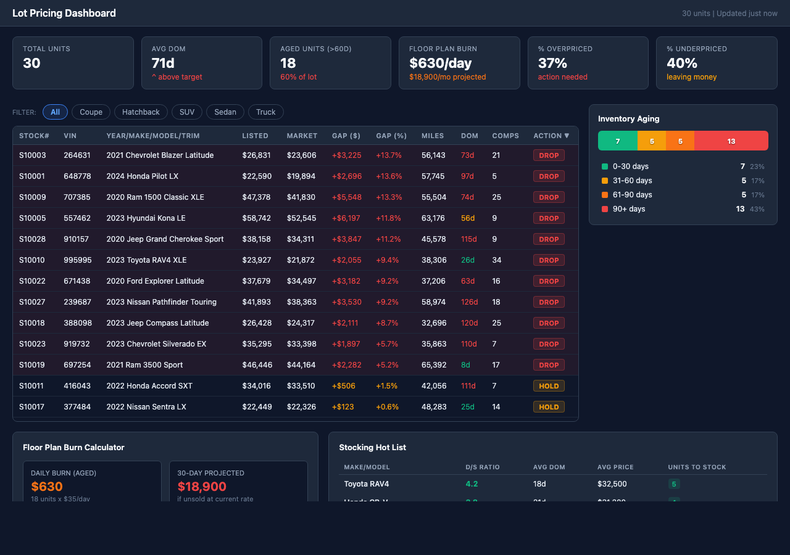

# Lot Pricing Dashboard 



## Overview

Full dealer inventory view with market price gaps, aging heatmap (0-30, 30-60, 60-90, 90+ days), floor plan burn rate, and stocking hot list from demand data. Each vehicle shows listed price vs market price, gap percentage, days on market, and comp count. KPIs include total units, avg DOM, aged units, and overpriced percentage.

## Who Is This For

Used car dealers, inventory managers, and pricing analysts

## MarketCheck API Endpoints Used

| Endpoint | Name | Docs |
|----------|------|------|
| `GET /v2/search/car/active` | Search Active Listings | [View docs](https://apidocs.marketcheck.com/#search-active) |
| `GET /v2/predict/car/us/marketcheck_price/comparables` | Price Prediction | [View docs](https://apidocs.marketcheck.com/#price-prediction) |
| `GET /api/v1/sold-vehicles/summary` | Sold Vehicle Summary | [View docs](https://apidocs.marketcheck.com/#sold-summary) |

## Parameters

| Name | Type | Required | Description |
|------|------|----------|-------------|
| `dealerId` | string | Yes | MarketCheck Dealer ID |
| `zip` | string | Yes | Dealer ZIP code |
| `state` | string | Yes | State for demand data |

## Derivative API Endpoint

**`POST https://apps.marketcheck.com/api/proxy/scan-lot-pricing`**

> This is a composite endpoint that orchestrates multiple MarketCheck API calls into a single response. It is provided for reference and experimentation purposes only and is not under LTS (Long-Term Support).

## How to Run

### Browser (standalone)

Open the app directly in a browser with your MarketCheck API key:

```
https://apps.marketcheck.com/app/lot-pricing-dashboard/?api_key=YOUR_API_KEY
```

### MCP (Model Context Protocol)

Add to your MCP client configuration (e.g. Claude Desktop):

```json
{
  "mcpServers": {
    "marketcheck": {
      "command": "npx",
      "args": [
        "-y",
        "@anthropic/marketcheck-mcp"
      ],
      "env": {
        "MARKETCHECK_API_KEY": "YOUR_API_KEY"
      }
    }
  }
}
```

### Embed (iframe)

Embed in any webpage:

```html
<iframe src="https://apps.marketcheck.com/app/lot-pricing-dashboard/?api_key=YOUR_API_KEY" width="100%" height="800" frameborder="0"></iframe>
```

## Limitations

- Demo mode shows mock data
- Requires MarketCheck API key for live data
- Browser-based — no server required for standalone use
- Data covers US market (95%+ of dealer inventory)

## Links

- [MarketCheck Developer Portal](https://developers.marketcheck.com)
- [API Documentation](https://apidocs.marketcheck.com)
- [Lot Pricing Dashboard App](https://apps.marketcheck.com/app/lot-pricing-dashboard/)
- [GitHub Repository](https://github.com/anthropics/marketcheck-mcp-apps)
