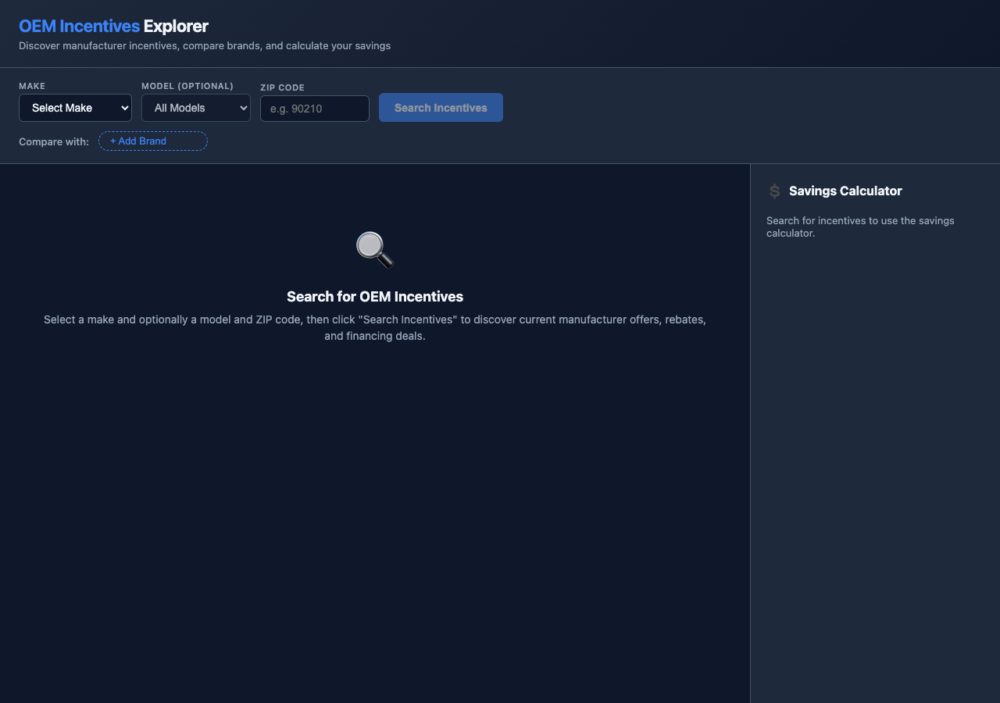

# OEM Incentives Explorer 



## Overview

Search and compare manufacturer incentives by ZIP code. Shows cash back rebates, APR financing specials, lease deals, and loyalty bonuses. Compare incentives across multiple brands side-by-side to find the best overall deal.

## Who Is This For

Car shoppers and buyers looking for market intelligence

## MarketCheck API Endpoints Used

| Endpoint | Name | Docs |
|----------|------|------|
| `GET /v2/incentives/by-zip` | OEM Incentives | [View docs](https://apidocs.marketcheck.com/#incentives) |

## Parameters

| Name | Type | Required | Description |
|------|------|----------|-------------|
| `make` | string | Yes | Manufacturer name |
| `model` | string | No | Specific model |
| `zip` | string | Yes | ZIP code |
| `compareMakes` | string[] | No | Brands to compare |

## Derivative API Endpoint

**`POST https://apps.marketcheck.com/api/proxy/oem-incentives-explorer`**

> This is a composite endpoint that orchestrates multiple MarketCheck API calls into a single response. It is provided for reference and experimentation purposes only and is not under LTS (Long-Term Support).

## How to Run

### Browser (standalone)

Open the app directly in a browser with your MarketCheck API key:

```
https://apps.marketcheck.com/app/oem-incentives-explorer/?api_key=YOUR_API_KEY
```

### MCP (Model Context Protocol)

Add to your MCP client configuration (e.g. Claude Desktop):

```json
{
  "mcpServers": {
    "marketcheck": {
      "command": "npx",
      "args": [
        "-y",
        "@anthropic/marketcheck-mcp"
      ],
      "env": {
        "MARKETCHECK_API_KEY": "YOUR_API_KEY"
      }
    }
  }
}
```

### Embed (iframe)

Embed in any webpage:

```html
<iframe src="https://apps.marketcheck.com/app/oem-incentives-explorer/?api_key=YOUR_API_KEY" width="100%" height="800" frameborder="0"></iframe>
```

## Limitations

- Demo mode shows mock data
- Requires MarketCheck API key for live data
- Browser-based — no server required for standalone use
- Data covers US market (95%+ of dealer inventory)

## Links

- [MarketCheck Developer Portal](https://developers.marketcheck.com)
- [API Documentation](https://apidocs.marketcheck.com)
- [OEM Incentives Explorer App](https://apps.marketcheck.com/app/oem-incentives-explorer/)
- [GitHub Repository](https://github.com/anthropics/marketcheck-mcp-apps)
