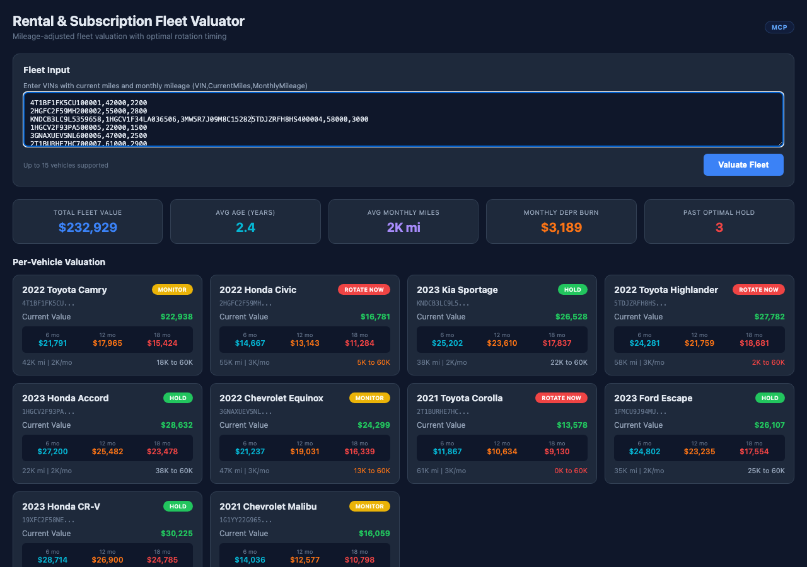

# Rental Fleet Valuator 



## Overview

Rental fleet valuation with mileage-adjusted pricing. Evaluates each vehicle in the fleet for current market value, factoring in high-mileage depreciation typical of rental use. Identifies vehicles approaching optimal rotation point.

## Who Is This For

Rental car companies and subscription fleet managers

## MarketCheck API Endpoints Used

| Endpoint | Name | Docs |
|----------|------|------|
| `GET /v2/decode/car/neovin/{vin}/specs` | VIN Decode | [View docs](https://apidocs.marketcheck.com/#decode-vin) |
| `GET /v2/predict/car/us/marketcheck_price/comparables` | Price Prediction | [View docs](https://apidocs.marketcheck.com/#price-prediction) |

## Parameters

| Name | Type | Required | Description |
|------|------|----------|-------------|
| `vins` | string | Yes | Fleet VINs |
| `zip` | string | Yes | Fleet location ZIP |

## Derivative API Endpoint

**`POST https://apps.marketcheck.com/api/proxy/value-rental-fleet`**

> This is a composite endpoint that orchestrates multiple MarketCheck API calls into a single response. It is provided for reference and experimentation purposes only and is not under LTS (Long-Term Support).

## How to Run

### Browser (standalone)

Open the app directly in a browser with your MarketCheck API key:

```
https://apps.marketcheck.com/app/rental-fleet-valuator/?api_key=YOUR_API_KEY
```

### MCP (Model Context Protocol)

Add to your MCP client configuration (e.g. Claude Desktop):

```json
{
  "mcpServers": {
    "marketcheck": {
      "command": "npx",
      "args": [
        "-y",
        "@anthropic/marketcheck-mcp"
      ],
      "env": {
        "MARKETCHECK_API_KEY": "YOUR_API_KEY"
      }
    }
  }
}
```

### Embed (iframe)

Embed in any webpage:

```html
<iframe src="https://apps.marketcheck.com/app/rental-fleet-valuator/?api_key=YOUR_API_KEY" width="100%" height="800" frameborder="0"></iframe>
```

## Limitations

- Demo mode shows mock data
- Requires MarketCheck API key for live data
- Browser-based — no server required for standalone use
- Data covers US market (95%+ of dealer inventory)

## Links

- [MarketCheck Developer Portal](https://developers.marketcheck.com)
- [API Documentation](https://apidocs.marketcheck.com)
- [Rental Fleet Valuator App](https://apps.marketcheck.com/app/rental-fleet-valuator/)
- [GitHub Repository](https://github.com/anthropics/marketcheck-mcp-apps)
