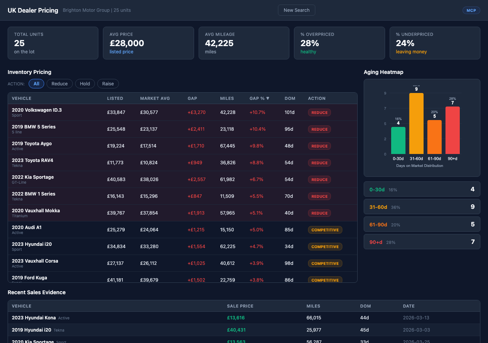

# UK Dealer Pricing -f59e0b?style=flat-square)



## Overview

UK dealer lot pricing dashboard. Shows dealer inventory with market comparison, price gaps, and recent sold data for benchmarking. Similar to the US Lot Pricing Dashboard but for the UK market.

## Who Is This For

UK car dealers

## MarketCheck API Endpoints Used

| Endpoint | Name | Docs |
|----------|------|------|
| `GET /v2/search/car/uk/active` | UK Active Listings | [View docs](https://apidocs.marketcheck.com/#uk-search) |
| `GET /v2/search/car/uk/recents` | UK Recent Listings | [View docs](https://apidocs.marketcheck.com/#uk-recent) |

## Parameters

| Name | Type | Required | Description |
|------|------|----------|-------------|
| `dealer_id` | string | Yes | UK dealer ID |
| `make` | string | No | Make filter for recents |

## Derivative API Endpoint

**`POST https://apps.marketcheck.com/api/proxy/scan-uk-lot-pricing`**

> This is a composite endpoint that orchestrates multiple MarketCheck API calls into a single response. It is provided for reference and experimentation purposes only and is not under LTS (Long-Term Support).

## How to Run

### Browser (standalone)

Open the app directly in a browser with your MarketCheck API key:

```
https://apps.marketcheck.com/app/uk-dealer-pricing/?api_key=YOUR_API_KEY
```

### MCP (Model Context Protocol)

Add to your MCP client configuration (e.g. Claude Desktop):

```json
{
  "mcpServers": {
    "marketcheck": {
      "command": "npx",
      "args": [
        "-y",
        "@anthropic/marketcheck-mcp"
      ],
      "env": {
        "MARKETCHECK_API_KEY": "YOUR_API_KEY"
      }
    }
  }
}
```

### Embed (iframe)

Embed in any webpage:

```html
<iframe src="https://apps.marketcheck.com/app/uk-dealer-pricing/?api_key=YOUR_API_KEY" width="100%" height="800" frameborder="0"></iframe>
```

## Limitations

- Demo mode shows mock data
- Requires MarketCheck API key for live data
- Browser-based — no server required for standalone use
- Data covers UK market

## Links

- [MarketCheck Developer Portal](https://developers.marketcheck.com)
- [API Documentation](https://apidocs.marketcheck.com)
- [UK Dealer Pricing App](https://apps.marketcheck.com/app/uk-dealer-pricing/)
- [GitHub Repository](https://github.com/anthropics/marketcheck-mcp-apps)
