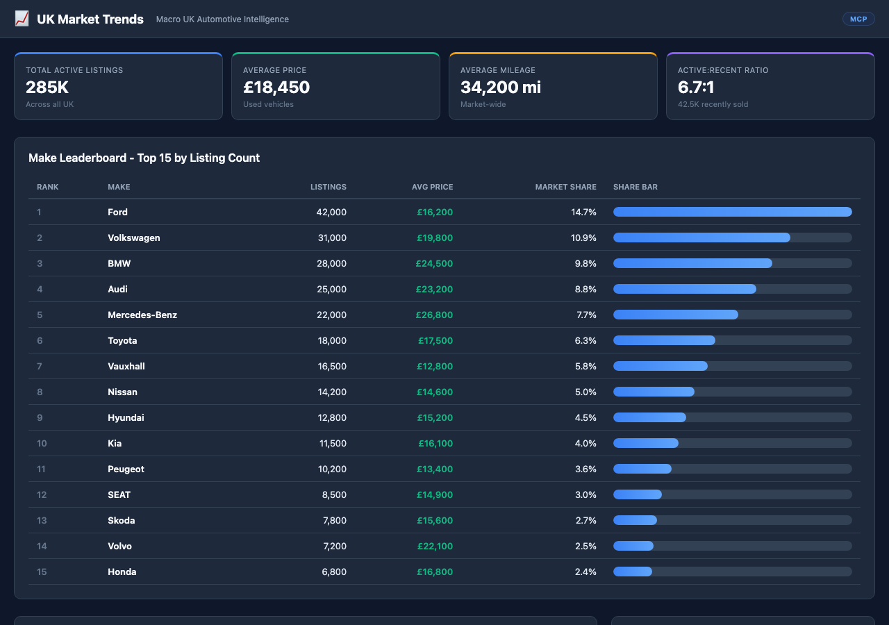

# UK Market Trends 



## Overview

UK automotive market statistics. Shows active and recent inventory levels, average prices in GBP, mileage distributions, and market trends for the UK car market. Filterable by make.

## Who Is This For

Anyone in the automotive industry

## MarketCheck API Endpoints Used

| Endpoint | Name | Docs |
|----------|------|------|
| `GET /v2/search/car/uk/active` | UK Active Listings | [View docs](https://apidocs.marketcheck.com/#uk-search) |
| `GET /v2/search/car/uk/recents` | UK Recent Listings | [View docs](https://apidocs.marketcheck.com/#uk-recent) |

## Parameters

| Name | Type | Required | Description |
|------|------|----------|-------------|
| `make` | string | No | Filter by make |

## Derivative API Endpoint

**`POST https://apps.marketcheck.com/api/proxy/get-uk-market-trends`**

> This is a composite endpoint that orchestrates multiple MarketCheck API calls into a single response. It is provided for reference and experimentation purposes only and is not under LTS (Long-Term Support).

## How to Run

### Browser (standalone)

Open the app directly in a browser with your MarketCheck API key:

```
https://apps.marketcheck.com/app/uk-market-trends/?api_key=YOUR_API_KEY
```

### MCP (Model Context Protocol)

Add to your MCP client configuration (e.g. Claude Desktop):

```json
{
  "mcpServers": {
    "marketcheck": {
      "command": "npx",
      "args": [
        "-y",
        "@anthropic/marketcheck-mcp"
      ],
      "env": {
        "MARKETCHECK_API_KEY": "YOUR_API_KEY"
      }
    }
  }
}
```

### Embed (iframe)

Embed in any webpage:

```html
<iframe src="https://apps.marketcheck.com/app/uk-market-trends/?api_key=YOUR_API_KEY" width="100%" height="800" frameborder="0"></iframe>
```

## Limitations

- Demo mode shows mock data
- Requires MarketCheck API key for live data
- Browser-based — no server required for standalone use
- Data covers UK market

## Links

- [MarketCheck Developer Portal](https://developers.marketcheck.com)
- [API Documentation](https://apidocs.marketcheck.com)
- [UK Market Trends App](https://apps.marketcheck.com/app/uk-market-trends/)
- [GitHub Repository](https://github.com/anthropics/marketcheck-mcp-apps)
