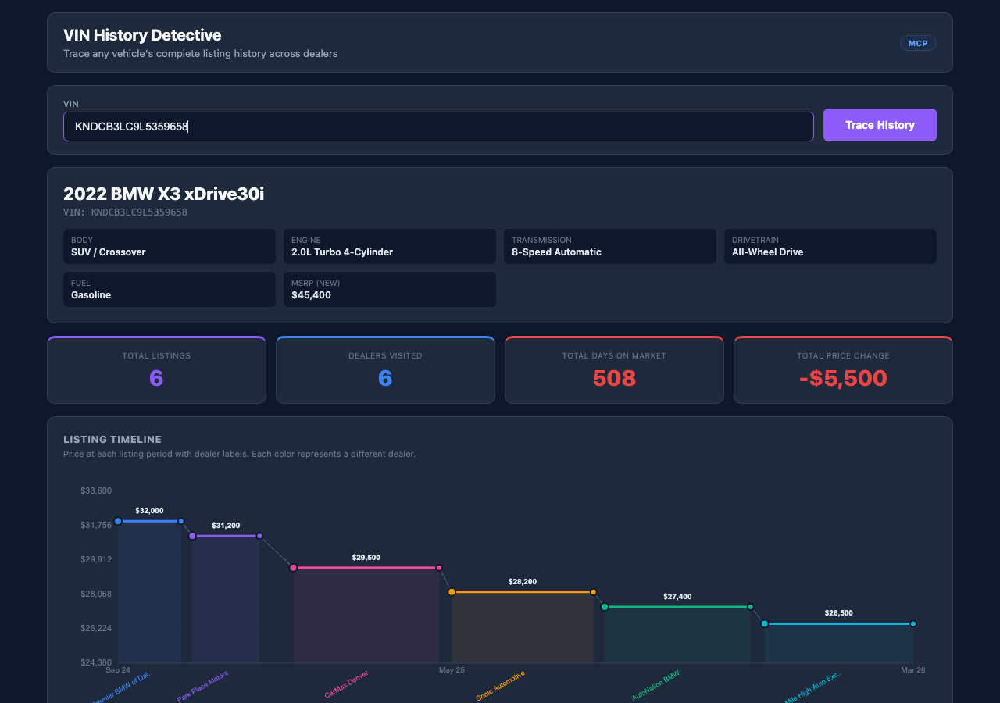

# VIN History Detective 



## Overview

Complete listing timeline for any VIN. Shows every price change, dealer transfer, and listing duration. Flags suspicious patterns (rapid relisting, large price drops, short hold times). Includes current market value prediction for context.

## Who Is This For

Anyone in the automotive industry

## MarketCheck API Endpoints Used

| Endpoint | Name | Docs |
|----------|------|------|
| `GET /v2/decode/car/neovin/{vin}/specs` | VIN Decode | [View docs](https://apidocs.marketcheck.com/#decode-vin) |
| `GET /v2/history/car/{vin}` | Car History | [View docs](https://apidocs.marketcheck.com/#car-history) |
| `GET /v2/predict/car/us/marketcheck_price/comparables` | Price Prediction | [View docs](https://apidocs.marketcheck.com/#price-prediction) |

## Parameters

| Name | Type | Required | Description |
|------|------|----------|-------------|
| `vin` | string | Yes | 17-character VIN |
| `miles` | number | No | Current mileage |
| `zip` | string | No | ZIP code |

## Derivative API Endpoint

**`POST https://apps.marketcheck.com/api/proxy/trace-vin-history`**

> This is a composite endpoint that orchestrates multiple MarketCheck API calls into a single response. It is provided for reference and experimentation purposes only and is not under LTS (Long-Term Support).

## How to Run

### Browser (standalone)

Open the app directly in a browser with your MarketCheck API key:

```
https://apps.marketcheck.com/app/vin-history-detective/?api_key=YOUR_API_KEY
```

### MCP (Model Context Protocol)

Add to your MCP client configuration (e.g. Claude Desktop):

```json
{
  "mcpServers": {
    "marketcheck": {
      "command": "npx",
      "args": [
        "-y",
        "@anthropic/marketcheck-mcp"
      ],
      "env": {
        "MARKETCHECK_API_KEY": "YOUR_API_KEY"
      }
    }
  }
}
```

### Embed (iframe)

Embed in any webpage:

```html
<iframe src="https://apps.marketcheck.com/app/vin-history-detective/?api_key=YOUR_API_KEY" width="100%" height="800" frameborder="0"></iframe>
```

## Limitations

- Demo mode shows mock data
- Requires MarketCheck API key for live data
- Browser-based — no server required for standalone use
- Data covers US market (95%+ of dealer inventory)

## Links

- [MarketCheck Developer Portal](https://developers.marketcheck.com)
- [API Documentation](https://apidocs.marketcheck.com)
- [VIN History Detective App](https://apps.marketcheck.com/app/vin-history-detective/)
- [GitHub Repository](https://github.com/anthropics/marketcheck-mcp-apps)
