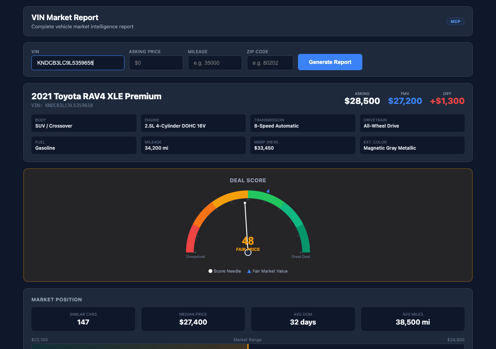

# VIN Market Report 



## Overview

A comprehensive market intelligence report for any vehicle by VIN. Includes deal score, price prediction (retail & wholesale), market position percentile, active and sold comparables, listing history timeline, depreciation curve, and available OEM incentives. Designed as an embeddable widget for dealer websites, marketplace listings, or financing portals.

## Who Is This For

Car shoppers and buyers looking for market intelligence

## MarketCheck API Endpoints Used

| Endpoint | Name | Docs |
|----------|------|------|
| `GET /v2/decode/car/neovin/{vin}/specs` | VIN Decode | [View docs](https://apidocs.marketcheck.com/#decode-vin) |
| `GET /v2/predict/car/us/marketcheck_price/comparables` | Price Prediction | [View docs](https://apidocs.marketcheck.com/#price-prediction) |
| `GET /v2/search/car/active` | Search Active Listings | [View docs](https://apidocs.marketcheck.com/#search-active) |
| `GET /v2/search/car/recents` | Search Recent/Sold | [View docs](https://apidocs.marketcheck.com/#search-recent) |
| `GET /v2/history/car/{vin}` | Car History | [View docs](https://apidocs.marketcheck.com/#car-history) |
| `GET /v2/incentives/by-zip` | OEM Incentives | [View docs](https://apidocs.marketcheck.com/#incentives) |

## Parameters

| Name | Type | Required | Description |
|------|------|----------|-------------|
| `vin` | string | Yes | 17-character VIN |
| `askingPrice` | number | No | Dealer asking price for deal score |
| `miles` | number | No | Current odometer reading |
| `zip` | string | No | ZIP code for regional pricing |

## Derivative API Endpoint

**`POST https://apps.marketcheck.com/api/proxy/generate-vin-market-report`**

> This is a composite endpoint that orchestrates multiple MarketCheck API calls into a single response. It is provided for reference and experimentation purposes only and is not under LTS (Long-Term Support).

## How to Run

### Browser (standalone)

Open the app directly in a browser with your MarketCheck API key:

```
https://apps.marketcheck.com/app/vin-market-report/?api_key=YOUR_API_KEY
```

### MCP (Model Context Protocol)

Add to your MCP client configuration (e.g. Claude Desktop):

```json
{
  "mcpServers": {
    "marketcheck": {
      "command": "npx",
      "args": [
        "-y",
        "@anthropic/marketcheck-mcp"
      ],
      "env": {
        "MARKETCHECK_API_KEY": "YOUR_API_KEY"
      }
    }
  }
}
```

### Embed (iframe)

Embed in any webpage:

```html
<iframe src="https://apps.marketcheck.com/app/vin-market-report/?api_key=YOUR_API_KEY" width="100%" height="800" frameborder="0"></iframe>
```

## Limitations

- Demo mode shows mock data
- Requires MarketCheck API key for live data
- Browser-based — no server required for standalone use
- Data covers US market (95%+ of dealer inventory)

## Links

- [MarketCheck Developer Portal](https://developers.marketcheck.com)
- [API Documentation](https://apidocs.marketcheck.com)
- [VIN Market Report App](https://apps.marketcheck.com/app/vin-market-report/)
- [GitHub Repository](https://github.com/anthropics/marketcheck-mcp-apps)
